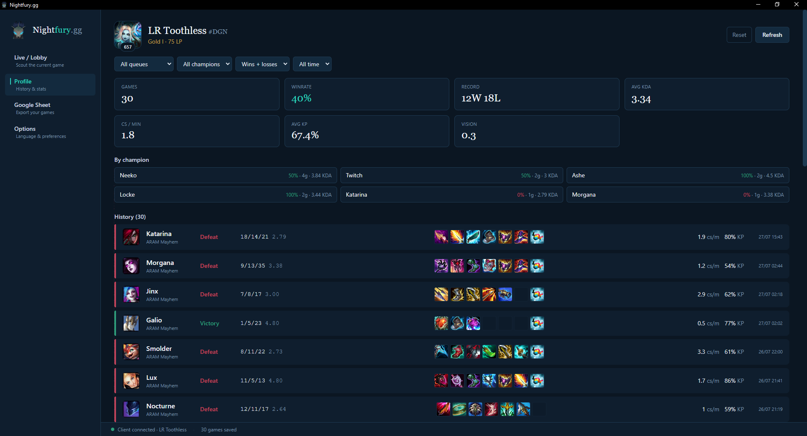
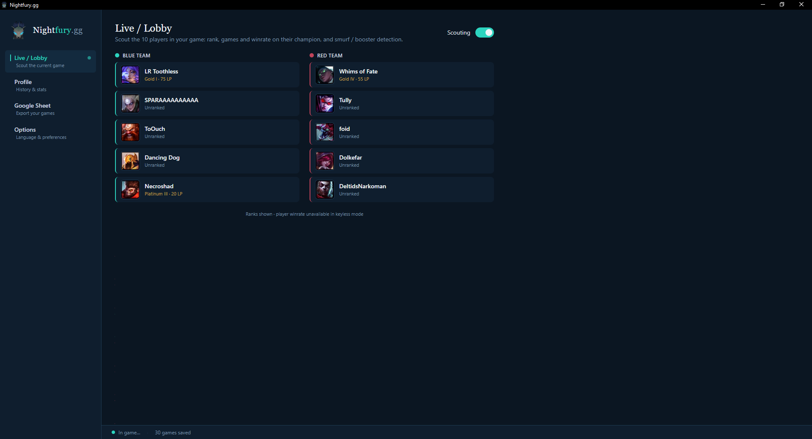
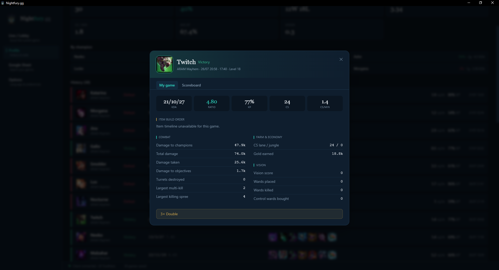
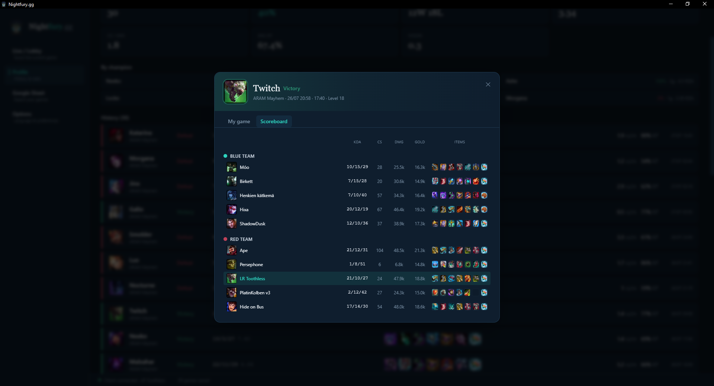

<div align="center">

# 🐉 Nightfury.gg

**A keyless League of Legends desktop companion.**
*Compagnon de bureau keyless pour League of Legends.*

Electron · React · TypeScript · Tailwind

[English](#english) · [Français](#français)

</div>

---

## Screenshots

|                   Profile                    |             Live / Lobby             |
| :------------------------------------------: | :----------------------------------: |
|                 |          |
|              **Match detail**               |            **Scoreboard**            |
|       |    |

---

## English

### What is Nightfury.gg?

**Nightfury.gg** is a desktop companion for League of Legends that reads your data
**directly from the game client** (the LCU) — so it needs **no Riot API key, no
login, and no secrets**. You just launch it while League is running and it works.

The name is a nod to *Toothless*, the **Night Fury** dragon — and the `.gg`
suffix follows the naming convention of LoL tools (op.gg, u.gg…), so it instantly
reads as a stats companion.

> Built to be shared publicly: **no secret in the code**, no access to anyone's
> account. Every user stays in control of their own data.

### Features

- **Profile** — an op.gg-style match history with **filters** (queue, champion,
  result, period), aggregate stats (winrate, KDA, CS/min, KP, vision) and
  per-champion breakdowns. A summoner header shows your icon, level and rank.
  Click any match to open it in two tabs:
  - **My game** — your full detailed stats plus an **item build timeline**
    (what you bought and when).
  - **Scoreboard** — all 10 players with champion, KDA, CS, damage, gold and
    their **items** (hover for full item tooltips).
- **Live / Lobby** — while you're in a game, see the **10 players** with their
  champion, Riot ID and **rank** — fetched keyless from your client session.
- **Google Sheet export** — send your history to a Google Sheet with **no Google
  login**: you paste a small Apps Script URL bound to *your* sheet. Manual or
  automatic (on game end), with an export filter, plus a zero-config **CSV** export.
- **Discord Rich Presence** *(optional, off by default)* — shows "Nightfury.gg"
  in your Discord status with your current champion and a game timer.
- **Options** — switch language (🇫🇷 / 🇬🇧), toggle Discord presence, and manage
  storage (free up space by removing games older than a month).
- **Bilingual** — full French / English interface.

### Keyless by design

The app never connects to any account and holds no secret. For the Sheet export,
the data flow is *your app → your script → your sheet* — nothing passes through a
third party. Rank data for other players comes from **your own client's session**,
the same way the game client itself talks to Riot's servers.

> **Note on player winrate:** showing *other* players' winrate / per-champion
> stats reliably would require a backend with a Riot **production** API key. To
> stay 100% keyless, Nightfury.gg shows other players' **rank** only. Their full
> stats are one click away on op.gg / Porofessor if you want them.

### Getting started (development)

Requirements: **Node.js 18+** and the League client installed.

```bash
npm install
npm run dev
```

### Build a distributable

```bash
npm run build      # type-check + bundle
npm run dist       # package a Windows .exe (via electron-builder)
```

The build uses the icon in `build/` and produces a portable executable named
**Nightfury.gg**.

### Optional setup

<details>
<summary><b>Discord Rich Presence</b></summary>

1. Create an app at <https://discord.com/developers/applications> named "Nightfury.gg".
2. Copy its **Application ID** into `src/main/discord-config.ts` (it is *not* a secret).
3. In **Rich Presence → Art Assets**, upload the dragon icon as an asset named `logo`.
4. Enable Discord presence in the app's **Options** tab.
</details>

<details>
<summary><b>Google Sheet export</b></summary>

1. Open your Google Sheet → **Extensions → Apps Script**.
2. Paste the script shown in the app's **Google Sheet** tab, and save.
3. **Deploy → New deployment → Web app**, access "Anyone".
4. Copy the deployment URL and paste it into the app.
</details>

### Tech stack

Electron + [electron-vite](https://electron-vite.org) · React + TypeScript ·
Tailwind CSS · [league-connect](https://github.com/matsjla/league-connect) for the
LCU · pure-JSON local storage (no native modules).

### Disclaimer

Nightfury.gg isn't endorsed by Riot Games and doesn't reflect the views or
opinions of Riot Games or anyone officially involved in producing or managing
League of Legends. League of Legends and Riot Games are trademarks or registered
trademarks of Riot Games, Inc.

### License

Released under the [MIT License](LICENSE).

---

## Français

### C'est quoi Nightfury.gg ?

**Nightfury.gg** est un compagnon de bureau pour League of Legends qui lit tes
données **directement depuis le client du jeu** (le LCU) — donc **aucune clé API
Riot, aucune connexion, aucun secret**. Tu le lances pendant que League tourne,
et ça marche.

Le nom est un clin d'œil à *Krokmou* (Toothless), le dragon **Night Fury** — et le
suffixe `.gg` reprend la convention des outils LoL (op.gg, u.gg…), pour qu'on
comprenne tout de suite que c'est un compagnon de stats.

> Conçu pour être partagé publiquement : **aucun secret dans le code**, aucun
> accès au compte de qui que ce soit. Chaque utilisateur reste maître de ses données.

### Fonctionnalités

- **Profil** — un historique façon op.gg avec **filtres** (file, champion,
  résultat, période), des stats agrégées (winrate, KDA, CS/min, KP, vision) et
  le détail par champion. Un en-tête affiche ton icône, ton niveau et ton rang.
  Clique sur une partie pour l'ouvrir en deux onglets :
  - **Ma partie** — toutes tes stats détaillées + la **frise d'achat des objets**
    (ce que tu as acheté et quand).
  - **Scoreboard** — les 10 joueurs avec champion, KDA, CS, dégâts, or et leurs
    **objets** (infobulle complète au survol).
- **Live / Lobby** — pendant une partie, vois les **10 joueurs** avec leur
  champion, leur Riot ID et leur **rang** — récupéré en keyless via la session
  de ton client.
- **Export Google Sheet** — envoie ton historique vers un Google Sheet **sans
  connexion Google** : tu colles une petite URL Apps Script rattachée à *ton*
  sheet. Manuel ou automatique (fin de partie), avec un filtre d'export, plus un
  export **CSV** sans configuration.
- **Présence Discord** *(optionnelle, désactivée par défaut)* — affiche
  « Nightfury.gg » dans ton statut Discord, avec ton champion et le chrono.
- **Options** — change de langue (🇫🇷 / 🇬🇧), active/désactive la présence Discord,
  et gère le stockage (libère de l'espace en supprimant les vieilles parties).
- **Bilingue** — interface complète français / anglais.

### Keyless par conception

L'appli ne se connecte à aucun compte et ne détient aucun secret. Pour l'export
Sheet, le flux est *ton appli → ton script → ton sheet* — rien ne transite par un
tiers. Le rang des autres joueurs vient de **la session de ton propre client**, de
la même façon que le client du jeu parle aux serveurs de Riot.

> **À propos du winrate des joueurs :** afficher de façon fiable le winrate /
> les stats par champion des *autres* joueurs nécessiterait un backend avec une
> clé API **de production** Riot. Pour rester 100 % keyless, Nightfury.gg affiche
> uniquement leur **rang**. Leurs stats complètes restent à un clic sur op.gg /
> Porofessor si tu les veux.

### Démarrage (développement)

Prérequis : **Node.js 18+** et le client League installé.

```bash
npm install
npm run dev
```

### Générer un exécutable

```bash
npm run build      # vérification des types + bundle
npm run dist       # empaquette un .exe Windows (via electron-builder)
```

Le build utilise l'icône du dossier `build/` et produit un exécutable portable
nommé **Nightfury.gg**.

### Configuration optionnelle

<details>
<summary><b>Présence Discord</b></summary>

1. Crée une application sur <https://discord.com/developers/applications> nommée « Nightfury.gg ».
2. Copie son **Application ID** dans `src/main/discord-config.ts` (ce n'est *pas* un secret).
3. Dans **Rich Presence → Art Assets**, uploade l'icône dragon sous le nom `logo`.
4. Active la présence Discord dans l'onglet **Options**.
</details>

<details>
<summary><b>Export Google Sheet</b></summary>

1. Ouvre ton Google Sheet → **Extensions → Apps Script**.
2. Colle le script affiché dans l'onglet **Google Sheet** de l'appli, puis enregistre.
3. **Déployer → Nouveau déploiement → Application web**, accès « Tout le monde ».
4. Copie l'URL du déploiement et colle-la dans l'appli.
</details>

### Avertissement

Nightfury.gg n'est pas approuvé par Riot Games et ne reflète pas les opinions de
Riot Games ni de quiconque impliqué officiellement dans la production ou la gestion
de League of Legends. League of Legends et Riot Games sont des marques ou des
marques déposées de Riot Games, Inc.

### Licence

Distribué sous [licence MIT](LICENSE).
